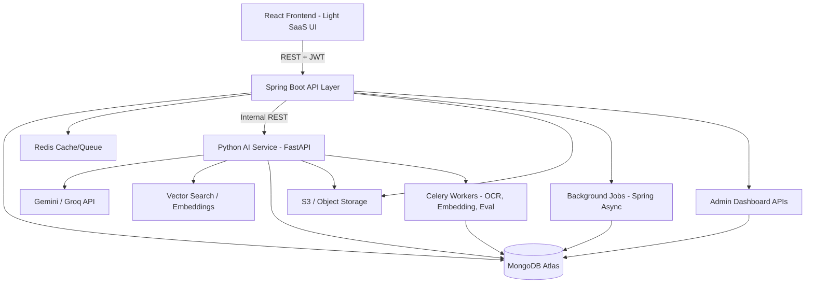

# AI Study Companion — Implementation Plan
**Stack:** Spring Boot (Java) · React · Python (AI/ML microservice) · MongoDB · Gemini / Groq API
**Timeline:** 4-day prototype build, phase-wise
**Target:** Candidate Challenge Submission (PRD v3.0)

---

## 0. Architecture Decision Summary

| Layer | Technology | Why |
|---|---|---|
| Frontend | React + Vite + TailwindCSS (light theme, SaaS aesthetic) | Fast dev, component reuse, easy theming |
| Core Backend (API/App layer) | Spring Boot (Java) | Auth, Spaces/Projects, Quiz, Mastery, Analytics, Admin — strong typing, validation, security |
| AI Service | Python (FastAPI) | Document processing, embeddings, RAG, Tutor orchestration, evaluation, LLM calls (Gemini/Groq) |
| Database | MongoDB (Atlas) | Flexible schema fits nested learning entities (concepts, mastery, events) |
| Vector/Retrieval | MongoDB Atlas Vector Search (or Chroma/FAISS inside Python service if Atlas tier unavailable) | Avoids extra infra; native to chosen DB |
| Background Jobs | Spring Boot `@Async` + a lightweight queue (RabbitMQ or MongoDB-backed job collection) for Java-side jobs; Celery/RQ (Redis) in Python service for AI-heavy jobs (OCR, embeddings, evaluation) | Matches "asynchronous by design" requirement cheaply |
| Auth | Spring Security + JWT (access/refresh tokens) | Standard, integrates cleanly with Spring |
| File Storage | AWS S3 / Cloudinary / local disk (dev) → S3-compatible bucket in prod | Needed for uploaded PDFs |
| Caching | Redis | Session/context caching, rate limiting, Celery broker |
| Observability | Structured logs (JSON) + a Mongo `ai_usage_logs` collection + simple Grafana/console dashboard, or just an Admin Dashboard page reading Mongo | Lightweight but demonstrates observability |
| Deployment | Frontend → Vercel/Netlify; Spring Boot → Render/Railway (Docker); Python service → Render/Railway (Docker); MongoDB Atlas (managed); Redis → Upstash | All free/cheap tiers, public URLs |

**Service Communication:** React → Spring Boot (REST, JWT-secured) → Python AI service (internal REST, service-to-service auth via shared secret header) → Gemini/Groq API. Spring Boot owns all business state; Python service is stateless-ish (reads/writes only through defined endpoints, so mastery/quiz state stays authoritative in one place).

---

## 1. High-Level Architecture



**Responsibility split:**
- **Spring Boot:** Auth, Users, Spaces, Projects, Materials metadata, Quiz orchestration & state, Mastery storage, Growth/Analytics endpoints, Recommendations storage, Activity/Event log, Admin APIs, Authorization/data isolation.
- **Python (FastAPI):** PDF parsing/OCR, chunking, embeddings, RAG retrieval, Tutor prompt orchestration, Gemini/Groq calls, open-ended answer grading, AI evaluation harness, structured-output validation before returning to Spring Boot.

---

## 2. MongoDB Data Model (Collections)

```
users              { _id, name, email, passwordHash, role[USER/ADMIN], createdAt }
spaces             { _id, userId, name, description, colorTheme, createdAt }
projects           { _id, spaceId, userId, name, description, goal, status, createdAt }
materials          { _id, projectId, fileName, s3Url, status[QUEUED/PROCESSING/READY/FAILED], pageCount, uploadedAt }
material_chunks    { _id, materialId, projectId, pageNumber, text, embedding[vector], concepts[] }
concepts           { _id, projectId, name, description, masteryScore, trend[IMPROVING/STABLE/ATTENTION], lastUpdated }
conversations       { _id, projectId, userId, title, createdAt }
messages           { _id, conversationId, role[user/assistant], content, citations[], createdAt }
quizzes            { _id, projectId, userId, status, questions[], startedAt, completedAt }
quiz_questions     { _id, quizId, type[MCQ/OPEN], conceptId, difficulty, question, options[], correctAnswer, userAnswer, evaluation{} }
assessments        { _id, projectId, quizId, score, strengths[], weaknesses[], createdAt }
mastery_history    { _id, projectId, conceptId, score, source, timestamp }
recommendations    { _id, projectId, text, reason, status[ACTIVE/DONE], createdAt }
learning_context   { _id, projectId, userId, goals, strengths[], weaknesses[], repeatedMistakes[], lastUpdated }
activity_events    { _id, userId, projectId, type, metadata, idempotencyKey, createdAt }
ai_usage_logs      { _id, feature, model, provider, tokensIn, tokensOut, latencyMs, costEstimate, status, errorMsg, createdAt }
jobs               { _id, type, status[QUEUED/RUNNING/DONE/FAILED], relatedId, retryCount, error, createdAt, updatedAt }
```

Indexes: `projects.userId`, `materials.projectId`, `activity_events.idempotencyKey` (unique), `material_chunks` vector index.

---

## 3. Frontend — Page-by-Page Plan (React, Light Theme SaaS Design)

**Design system:** soft neutral background (#FAFAFC), white cards with subtle shadow, accent color (indigo/teal), rounded-xl corners, Inter/Poppins font, generous whitespace, subtle motion (Framer Motion) for transitions — read the `frontend-design` skill guidance when this is actually built for token-level detail.

| # | Page/Route | Purpose | Key Components |
|---|---|---|---|
| 1 | `/login`, `/register` | Auth | Form, validation, JWT storage |
| 2 | `/home` | User Home Dashboard | Continue Learning card, Recent Projects, Overall progress ring, Areas needing attention, Recommended next action |
| 3 | `/spaces` | List/create Spaces | Space cards grid, create modal |
| 4 | `/spaces/:id` | Space Dashboard | Project list, aggregated progress, activity feed |
| 5 | `/projects/:id` | Project Dashboard | Progress summary, key concepts, recent activity, recommended next step, nav tabs to Materials/Tutor/Quiz/Growth/Analytics |
| 6 | `/projects/:id/materials` | Materials | Upload (drag-drop PDF), processing status badges (Queued/Processing/Ready/Failed), material list with page count |
| 7 | `/projects/:id/tutor` | AI Tutor chat | Chat UI, streaming responses, citation chips ("Source: ML Notes — Page 14"), "insufficient evidence" state UI, conversation history sidebar |
| 8 | `/projects/:id/quiz` | Adaptive Quiz | Question card (MCQ/open-ended), timer optional, submit, instant feedback panel explaining what's understood/missing |
| 9 | `/projects/:id/growth` | Mastery & Growth | Mastery bars per concept, trend chart (improving/stable/attention), history timeline |
| 10 | `/projects/:id/analytics` | Project Analytics | Charts: activity over time, quiz performance, concept trends, AI usage summary |
| 11 | `/analytics/global` | Global Analytics | Cross-project aggregation |
| 12 | `/admin` | Admin Dashboard | Users table, Spaces/Projects overview, Activity feed w/ filters, AI usage & cost charts, AI evaluation results, background job monitor, system health widget |
| 13 | `/admin/users/:id` | Admin → User detail | Projects, activity, assessments, progress, AI usage for that user |

Shared components: `Navbar`, `Sidebar`, `ProgressRing`, `CitationCard`, `StatusBadge`, `ToastProvider`, `ProtectedRoute` (JWT + role check).

---

## 4. Spring Boot — Module & API Plan

```
com.studycompanion
 ├── auth/          → /api/auth/register, /login, /refresh
 ├── space/         → /api/spaces (CRUD)
 ├── project/       → /api/projects (CRUD, dashboard summary)
 ├── material/      → /api/materials (upload, status, list) — delegates processing to Python
 ├── tutor/         → /api/tutor/ask, /conversations — proxies to Python, persists messages
 ├── quiz/          → /api/quiz/start, /answer, /next, /complete
 ├── mastery/       → /api/mastery/:projectId, growth history
 ├── recommendation/→ /api/recommendations/:projectId
 ├── analytics/     → /api/analytics/project/:id, /api/analytics/global
 ├── activity/      → internal event publisher + /api/activity/:projectId
 ├── admin/         → /api/admin/users, /projects, /activity, /ai-usage, /jobs, /health
 ├── security/      → JWT filter, method-level @PreAuthorize, ownership checks
 ├── job/           → Async job runner + job status collection
 └── common/        → DTOs, exception handlers, validation, ApiResponse wrapper
```

Cross-cutting: every Project-scoped endpoint validates `project.userId == authenticatedUser.id` (data isolation). All AI-triggering endpoints validate/sanitize input before forwarding to Python (never pass raw uploaded document text as "instructions").

---

## 5. Python AI Service — Module Plan (FastAPI)

```
app/
 ├── main.py
 ├── routers/
 │   ├── ingest.py        → /ingest (OCR, chunk, embed, extract concepts)
 │   ├── tutor.py         → /tutor/answer (RAG + citation + insufficient-evidence logic)
 │   ├── quiz.py          → /quiz/generate-question, /quiz/evaluate-open-ended
 │   ├── recommend.py     → /recommend/generate
 │   ├── growth.py        → /growth/analyze
 │   └── eval.py          → /eval/run (offline evaluation harness)
 ├── services/
 │   ├── llm_client.py    → provider-agnostic wrapper (Gemini primary, Groq fallback)
 │   ├── retrieval.py     → vector search + reranking
 │   ├── ocr.py           → PyMuPDF/pdfplumber + OCR fallback (Tesseract) for scanned pages
 │   ├── chunking.py
 │   ├── prompt_templates/
 │   └── structured_output.py → Pydantic schema validation for every LLM structured response
 ├── workers/              → Celery tasks: process_material, evaluate_quiz_answer, generate_recommendation
 └── core/                 → config, logging, auth (shared-secret header from Spring Boot)
```

**LLM Provider Abstraction (important for "Should Have: Provider abstraction"):**
```python
class LLMProvider(Protocol):
    def generate(self, prompt, schema=None) -> LLMResponse: ...

class GeminiProvider(LLMProvider): ...
class GroqProvider(LLMProvider): ...

# config-driven: PRIMARY_PROVIDER=gemini, FALLBACK_PROVIDER=groq
```
Every call logs `{model, feature, tokensIn, tokensOut, latencyMs, cost, status}` to `ai_usage_logs` via Spring Boot internal endpoint or direct Mongo write.

**Grounded Tutor flow (Section 7 of PRD):**
1. Receive question + projectId + conversationId.
2. Fetch last N relevant messages (short, not full history) + retrieve top-k chunks via vector search scoped to `projectId`.
3. If retrieval score below threshold → return "insufficient evidence" structured response (no fabrication).
4. Else → build grounded prompt with chunk citations → call LLM → validate output includes source references → return `{answer, citations[], confidence}`.

**Prompt-injection defense:** material text and user messages are always wrapped as `<data>` blocks, never concatenated as system instructions; a system prompt explicitly instructs the model to treat material content as reference data only.

---

## 6. Phase-Wise Build Plan (4 Days)

### **Phase 1 — Foundations & Skeleton (Day 1, ~8h)**
- [ ] Repo setup: monorepo or 3 repos (`frontend/`, `backend/`, `ai-service/`) + root README
- [ ] Spring Boot project init: Security config, JWT auth, User model, MongoDB connection
- [ ] React project init: Vite + Tailwind, routing skeleton, light theme tokens, auth pages
- [ ] Python FastAPI init: base app, health check, Mongo connection, Gemini/Groq client wrapper
- [ ] Docker Compose for local dev (Spring Boot + FastAPI + MongoDB + Redis)
- [ ] Spaces & Projects CRUD (backend + frontend pages: create/list/dashboard shell)
- [ ] Deploy skeletons early (get public URLs working Day 1 to de-risk deployment)

### **Phase 2 — Materials & Document Processing Pipeline (Day 1 end – Day 2 morning)**
- [ ] File upload endpoint (Spring Boot) → S3 storage → create `materials` doc (status QUEUED)
- [ ] Publish job event → Python Celery worker picks up
- [ ] Python: PDF text/table/image extraction (PyMuPDF) + OCR fallback for scanned pages (Tesseract)
- [ ] Chunking + concept extraction (LLM-assisted) + embeddings generation
- [ ] Store chunks + embeddings in MongoDB, update material status (PROCESSING → READY/FAILED)
- [ ] Retry logic (max 3 attempts, exponential backoff) + failure surfaced to UI
- [ ] Frontend: upload UI with drag-drop, live status polling/websocket

### **Phase 3 — AI Tutor with Grounded Citations (Day 2)**
- [ ] Vector search retrieval endpoint (Python)
- [ ] Tutor RAG pipeline: context assembly (conversation + retrieved knowledge + learning context)
- [ ] Insufficient-evidence branch implemented & tested explicitly
- [ ] Spring Boot: `/tutor/ask` proxy, persist `messages` with citations
- [ ] Streaming response (SSE or chunked) — Should Have, attempt if time allows
- [ ] Frontend: chat UI, citation chips linking back to material page, "not enough evidence" state styling
- [ ] Log every Tutor call to `ai_usage_logs`

### **Phase 4 — Adaptive Quiz & Assessment (Day 2 end – Day 3 morning)**
- [ ] Quiz orchestration state machine in Spring Boot (start → select concept/difficulty → request question from Python → user answers → evaluate → update mastery → next)
- [ ] Python: MCQ generation + open-ended question generation grounded in materials
- [ ] Python: open-ended answer evaluation (rubric: understanding, accuracy, relevance, missing concepts) → structured JSON validated via Pydantic
- [ ] Mastery update logic (weighted by recency, difficulty, correctness — not naive wrong→easy/correct→hard)
- [ ] Frontend: quiz flow UI, feedback panel showing what was understood vs missing

### **Phase 5 — Mastery, Growth & Recommendations (Day 3)**
- [ ] `mastery_history` writes on every assessment event
- [ ] Growth analysis job: classify concept trend (improving/stable/attention) using mastery_history deltas
- [ ] Recommendation generation (Python, LLM-assisted using weaknesses + recent mistakes + goals) → stored in `recommendations`
- [ ] Repeated-mistake workflow: detect pattern across quiz_questions → update `learning_context` → targeted recommendation
- [ ] Frontend: Growth page (mastery bars, trend badges, timeline chart), Recommendation card on dashboards

### **Phase 6 — Analytics, Activity Events & Admin Dashboard (Day 3 end – Day 4 morning)**
- [ ] Event-driven activity logging (idempotency key per event, dedup on write)
- [ ] Project Analytics endpoint + charts (activity, quiz performance, concept trends, AI usage)
- [ ] Global Analytics aggregation endpoint
- [ ] Admin APIs: users, spaces/projects, activity filters, AI usage/cost, AI eval results, job monitor, system health
- [ ] Frontend: Analytics pages (Recharts), Admin Dashboard + per-user drill-down page
- [ ] Role-based access control for `/admin/*`

### **Phase 7 — Observability, Evaluation, Security Hardening (Day 4)**
- [ ] Structured JSON logging across both services; correlate via request/trace ID
- [ ] `ai_usage_logs` dashboard widget (latency, cost, failures by feature/model)
- [ ] Evaluation harness (Python): curated test set for Tutor groundedness, retrieval relevance, quiz grading quality, recommendation relevance — script + results stored/exported
- [ ] Security pass: authZ checks on every Project-scoped route, input validation (Bean Validation + Pydantic), rate limiting (Redis), secure file handling (type/size checks, S3 signed URLs), prompt-injection test cases
- [ ] Error handling pass: AI timeouts, provider fallback (Gemini→Groq), DB errors, background job failure states surfaced in UI/Admin

### **Phase 8 — Testing, Docs, Deployment & Submission (Day 4)**
- [ ] Backend tests: auth, authorization/isolation, quiz mastery logic, validation (JUnit + Mockito)
- [ ] AI tests: grounded vs unsupported question cases, structured-output schema validation, evaluation rubric sanity (Pytest)
- [ ] Frontend smoke tests (Vitest/RTL) for critical flows
- [ ] Final deployment (see Section 7)
- [ ] Write README, architecture doc, AI usage doc, dev-prompts log, evaluation approach doc, known limitations, future improvements
- [ ] Record demo video following the required flow (Section 20 of PRD)
- [ ] Final QA pass through full learning loop end-to-end as one user + as admin

---

## 7. Deployment Plan

| Component | Platform | Notes |
|---|---|---|
| MongoDB | MongoDB Atlas (Free/M10 tier) | Enable Vector Search index on `material_chunks.embedding` |
| Redis | Upstash Redis (free tier) | Celery broker + caching + rate limiting |
| File Storage | AWS S3 (or Cloudinary for simplicity) | Signed upload URLs, private bucket |
| Spring Boot API | Render or Railway (Docker container) | Env vars for Mongo URI, JWT secret, S3 keys, internal Python service URL |
| Python AI Service | Render or Railway (Docker container, separate service) | Env vars for Gemini/Groq API keys, Mongo URI, Redis URL, shared-secret for internal auth |
| Celery Worker | Same Python image, run as a second Render/Railway service (worker dyno) | Needed since ingestion/evaluation must run in background |
| Frontend | Vercel or Netlify | Env var for API base URL, auto-deploy from `main` |
| Secrets | Platform env var managers (never committed); `.env.example` in repo | Meets "secrets separated from source" requirement |
| CI/CD | GitHub Actions: run backend + AI service tests on PR, auto-deploy on merge to `main` | Optional but strengthens submission |

**Deployment order:** MongoDB Atlas + Redis first → Python AI service → Spring Boot (pointing to Python service URL) → Frontend (pointing to Spring Boot URL) → smoke test full loop in production.

---

## 8. Requirements Traceability (Must-Have Checklist)

| PRD Must-Have | Covered In Phase |
|---|---|
| Authentication | 1 |
| Spaces & Projects | 1 |
| PDF materials + background processing | 2 |
| AI Tutor, grounded answers + citations, unsupported-question handling | 3 |
| Adaptive Quiz, open-ended assessment | 4 |
| Concept mastery, growth analysis, recommendations | 5 |
| Project & global analytics, activity tracking | 6 |
| Admin Dashboard | 6 |
| Persistent relevant learning context | 3, 5 |
| Project-level data isolation | 1, 7 |
| Structured AI interaction | 4, 5 |
| Basic AI observability & evaluation | 7 |
| Error handling | 7 |
| Testing, deployment, public repo, architecture docs | 8 |

**Should-Have items to attempt if time allows (in priority order):** streaming Tutor (Phase 3), provider abstraction (already built into Phase 1/3 design), caching (Phase 1 Redis, reused throughout), AI tracing via `ai_usage_logs` (Phase 7), automated regression evaluation (Phase 7).

**Nice-to-have (only if all above is solid):** flashcards or spaced-repetition view generated from weak concepts — cheap to add on top of existing mastery/quiz data model, good differentiator without much extra time.

---

## 9. Submission Package Checklist
- [ ] Deployed public URLs (frontend + backend + AI service reachable)
- [ ] Public GitHub repo(s) with README, setup, config examples, architecture doc, test/deploy instructions
- [ ] Architecture diagram (this doc's Section 1, refined)
- [ ] AI usage documentation: build-time AI tools vs product-time AI (Tutor/quiz/recs/doc understanding/eval)
- [ ] Development prompts log, organized by architecture/frontend/backend/database/AI/debugging/testing/docs
- [ ] Evaluation approach write-up
- [ ] Known limitations write-up
- [ ] Future improvements write-up
- [ ] Demo video covering the exact flow in PRD Section 20

---

### Notes on Scope Discipline
Given the 3–4 day window, the riskiest items are: OCR quality, streaming, and full evaluation automation. Build the **core loop end-to-end first** (Space→Project→Material→Tutor→Quiz→Mastery→Growth→Analytics→Recommendation→Admin) with simple implementations, then go back and deepen (streaming, better retrieval, richer eval) only after the loop works without losing context anywhere — this matches the PRD's stated primary success criterion directly.
