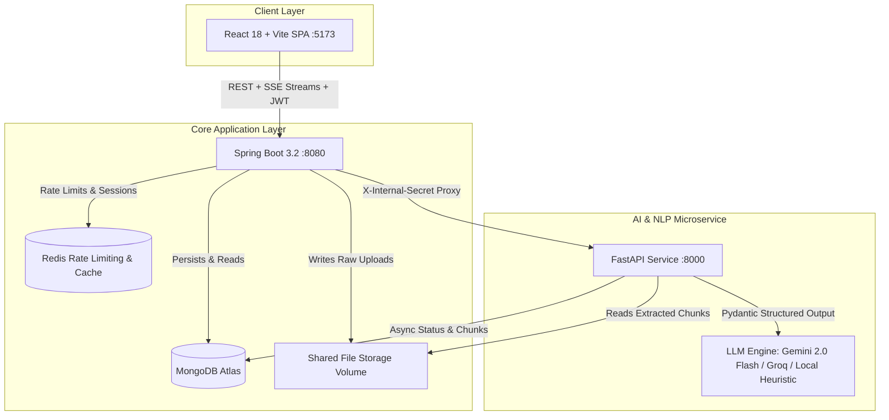

# Lumina Study — AI-Powered Study Companion & Adaptive Learning Platform

[](https://spring.io/projects/spring-boot)
[](https://openjdk.org/)
[](https://fastapi.tiangolo.com/)
[](https://python.org/)
[](https://react.dev/)
[](https://vitejs.dev/)
[](https://tailwindcss.com/)
[](https://www.mongodb.com/)
[](https://redis.io/)
[](https://www.docker.com/)

**Lumina Study** is a modern, full-stack, context-aware AI Study Companion and personalized learning platform. It transforms course documents and lecture slides into an interactive, hallucination-resistant learning ecosystem featuring **real-time streaming grounded tutoring with citations**, **0ms cached concept knowledge graphs**, **spaced repetition flashcards (SM-2)**, **adaptive testing**, **mistake diagnostic notebooks**, and **personalized study planning**.

---

## Table of Contents

- [Architecture Overview](#architecture-overview)
- [Key Features](#key-features)
- [Tech Stack](#tech-stack)
- [System Requirements](#system-requirements)
- [Getting Started (Local Development)](#getting-started-local-development)
  - [1. Environment Configuration](#1-environment-configuration)
  - [2. Infrastructure (MongoDB & Redis)](#2-infrastructure-mongodb--redis)
  - [3. Backend API Service](#3-backend-api-service)
  - [4. Python AI Microservice](#4-python-ai-microservice)
  - [5. React Frontend Application](#5-react-frontend-application)
- [All-in-One Docker Orchestration](#all-in-one-docker-orchestration)
- [Default Credentials](#default-credentials)
- [Production Deployment](#production-deployment)
- [Testing & Quality Assurance](#testing--quality-assurance)
- [API Reference Overview](#api-reference-overview)
- [Repository Structure](#repository-structure)
- [Documentation Index](#documentation-index)

---

## Architecture Overview

Lumina Study separates authoritative business operations from compute-intensive AI operations:



### Architectural Principles
1. **Authoritative State Isolation:** The Spring Boot backend owns users, projects, materials metadata, mastery math, and permissions. The browser **never** talks directly to the AI service or external LLMs.
2. **Deterministic Retrieval & Grounding:** PDF extracts are split into semantic chunks with deterministic hash embeddings. The AI tutor evaluates retrieval confidence and refuses to answer when evidence is below the threshold, completely preventing hallucinations.
3. **Internal Zero-Trust Security:** Service-to-service communication between Spring Boot and FastAPI is secured with shared secrets (`X-Internal-Secret`). User inputs are sanitized and wrapped in `<data>` isolation blocks to safeguard against prompt-injection attacks.

---

## Key Features

### 🤖 Grounded AI Tutor with Live SSE Streaming
- **Server-Sent Events (SSE):** Low-latency token streaming through Spring Boot to the React frontend with rich GitHub Markdown and LaTeX math rendering (`$...$` and `$$...$$`).
- **Verifiable Citation Badges:** Every answer provides verifiable citations linking directly to the source document name, page number, and original excerpt.
- **Anti-Hallucination Guardrail:** If cosine similarity against indexed material chunks is below `RETRIEVAL_THRESHOLD` (default 0.35), the tutor triggers an **insufficient evidence** alert rather than hallucinating facts.

### 🧭 Interactive Concept Graph (0ms Navigation)
- Visual, interactive knowledge graph displaying nodes, categories, difficulty tiers, and prerequisite relationships.
- **Instant 0ms Caching:** Concept graph topology is generated once, persisted in MongoDB (`concept_graphs`), and instantly reloaded during navigation with real-time mastery overlays.
- **Explicit Re-scanning:** Learners control when to trigger an AI material rescan via the "Rescan Materials" action.

### 🗂️ Smart Flashcards & Spaced Repetition (SM-2)
- Automated flashcard deck generation targeting unmastered concepts and items flagged for attention.
- Incorporates the **SuperMemo-2 (SM-2)** algorithm to calculate repetition intervals, ease factors, and review schedules based on user ratings (Again, Hard, Good, Easy).

### 🎯 Adaptive Quizzing & Mastery Engine
- Dynamic question generation adapting to current mastery: Easy (<40%), Medium (40-75%), Hard (>75%).
- Supports both Multiple Choice Questions (MCQ) and open-ended questions graded against an AI evaluation rubric (0.0 to 1.0).
- **Weighted Mastery Formulation:**
  $$\text{Mastery}_{\text{new}} = \text{Mastery}_{\text{old}} \times 0.72 + (\text{Score} \times \text{DifficultyWeight}) \times 0.28$$

### 📝 Mistakes Notebook & Diagnostic Analysis
- Every missed quiz question is automatically cataloged in the Mistakes Notebook.
- Learners can run **AI Misconception Analysis** to diagnose why an error occurred and receive targeted corrective study recommendations.

### 📅 Adaptive Study Planner
- Generate customized study roadmaps based on target exam dates and available weekly study hours.
- Automated milestone scheduling prioritized by weakest and prerequisite concepts.

### 📊 Growth Analytics & Progress Radar
- Track mastery progression, retention health, quiz histories, and active study streaks across projects.

### 🛡️ Admin Suite & Runtime LLM Management
- Real-time observability: token usage, estimated costs, background jobs, user management, and MongoDB health checks.
- **Runtime Provider Switching:** Configure and test API keys dynamically (Google Gemini, Groq, or Local Heuristic) directly within the Admin UI without restarting any containers.

---

## Tech Stack

| Domain | Technology | Details |
|---|---|---|
| **Frontend** | React 18, Vite 5, Tailwind CSS | Light SaaS design, Lucide icons, Canvas API |
| **Backend** | Spring Boot 3.2, Java 17 | Spring Security, Spring Data MongoDB, SseEmitter |
| **AI Microservice** | FastAPI, Python 3.11 | PyMuPDF, Tesseract OCR, Pydantic v2, Uvicorn |
| **Database** | MongoDB Atlas / Local MongoDB 7.0 | Multi-tenant collections, chunk vector storage |
| **Caching & Queue** | Redis 7.0 | Rate limiting, session caching |
| **LLM Providers** | Google Gemini 2.0 Flash, Groq | Configurable at runtime with local fallback |
| **Deployment** | Docker, Render, Vercel | Multi-stage Docker production image |

---

## System Requirements

- **Java Development Kit (JDK):** Version 17 or higher
- **Apache Maven:** Version 3.8+ (or use `./mvnw`)
- **Python:** Version 3.11 or higher
- **Node.js:** Version 20+ and `npm`
- **Docker & Docker Compose:** For containerized local infrastructure

---

## Getting Started (Local Development)

### 1. Environment Configuration

Copy the sample environment file to `.env`:

```bash
cp .env.example .env
```

Key environment variables in `.env`:

```ini
# AI Provider Keys (Optional: local heuristic works without keys)
GEMINI_API_KEY=your_gemini_api_key_here
GROQ_API_KEY=your_groq_api_key_here
PRIMARY_PROVIDER=gemini
FALLBACK_PROVIDER=groq

# Security Secrets
JWT_SECRET=your-32-byte-long-secret-key-here-lumina
INTERNAL_SERVICE_SECRET=your-internal-service-secret-token-here

# Databases & URLs
MONGO_URI=mongodb://localhost:27017/study_companion
REDIS_HOST=localhost
REDIS_PORT=6379
SPRING_INTERNAL_URL=http://localhost:8080
AI_SERVICE_URL=http://localhost:8000
```

### 2. Infrastructure (MongoDB & Redis)

Start MongoDB and Redis using Docker:

```bash
docker compose up mongo redis -d
```

### 3. Backend API Service

```bash
cd backend
mvn spring-boot:run
```

- API Base URL: `http://localhost:8080`
- Health Check: `http://localhost:8080/actuator/health` (or `/api/auth/health`)

### 4. Python AI Microservice

```bash
cd ai-service

# Create and activate virtual environment
python -m venv .venv

# On Windows:
.venv\Scripts\activate
# On macOS / Linux:
# source .venv/bin/activate

# Install dependencies
pip install -r requirements.txt

# Start FastAPI with hot reload
uvicorn app.main:app --reload --port 8000
```

- AI Service Docs: `http://localhost:8000/docs`

### 5. React Frontend Application

```bash
cd frontend
npm install
npm run dev
```

- Application URL: `http://localhost:5173`

---

## All-in-One Docker Orchestration

To run the entire ecosystem (Frontend, Spring Boot API, FastAPI AI service, MongoDB, and Redis) simultaneously:

```bash
docker compose up --build
```

| Service | Host Port | Internal Port | Description |
|---|---|---|---|
| **Frontend Web App** | `5173` | `80` (Nginx) | React Web Application |
| **Spring Boot API** | `8080` | `8080` | Core Application Service |
| **FastAPI AI Service** | `8000` | `8000` | AI / NLP Microservice |
| **MongoDB** | `27017` | `27017` | Database |
| **Redis** | `6381` | `6379` | Cache & Rate Limiter |

---

## Default Credentials

The application automatically seeds a default administrator account upon initial startup:

- **Email:** `admin@studycompanion.local`
- **Password:** `Admin123!`
- **Admin Suite:** Accessible via `/admin`

Standard users can self-register directly through the `/login` registration interface.

---

## Production Deployment

Lumina Study is architected for low-cost, high-performance cloud hosting:

- **Frontend:** Deployed to **Vercel** (`frontend/vercel.json`) with client-side SPA routing.
- **Backend & AI Services:** Packaged into a unified, multi-stage production container (`Dockerfile.production` orchestrated by `start-production.sh`) deployed to **Render** via `render.yaml`.
- **Database:** Managed **MongoDB Atlas** cluster.
- **Cache:** **Redis Cloud** or **Upstash Redis**.

For step-by-step instructions, view:
- 📖 [Production Deployment Guide](file:///docs/../DEPLOYMENT.md)
- 📋 [Production Deployment Checklist](file:///docs/../DEPLOYMENT_CHECKLIST.md)

---

## Testing & Quality Assurance

The codebase includes automated unit, integration, and policy regression tests across all three service layers:

```bash
# 1. Backend tests (JUnit - BCrypt, mastery logic, security)
cd backend && mvn test

# 2. AI Service tests (Pytest - Chunker, hash embeddings, retrieval thresholds, eval schemas)
cd ai-service && pytest

# 3. Frontend tests (Vitest + React Testing Library)
cd frontend && npm test
```

### Continuous Integration (CI)
GitHub Actions (`.github/workflows/ci.yml`) automatically runs all three test suites on every pull request and push to the `main` branch.

---

## API Reference Overview

| Domain | Method | Endpoint | Description |
|---|---|---|---|
| **Auth** | `POST` | `/api/auth/register` | Register new learner account |
| **Auth** | `POST` | `/api/auth/login` | Authenticate & receive access/refresh JWTs |
| **Spaces** | `GET/POST` | `/api/spaces` | List or create learning spaces |
| **Projects** | `GET/POST` | `/api/projects` | List or create learning projects |
| **Materials** | `POST` | `/api/projects/{id}/materials/upload` | Upload PDF (max 20MB) and queue ingest |
| **Concept Graph**| `GET` | `/api/projects/{id}/concepts/graph` | Fetch 0ms cached knowledge graph |
| **Concept Graph**| `POST` | `/api/projects/{id}/concepts/graph/regenerate`| Explicit AI rescan of materials |
| **Tutor (SSE)** | `POST` | `/api/tutor/stream` | Stream real-time grounded tutor answer |
| **Tutor (REST)**| `POST` | `/api/tutor/ask` | Synchronous grounded tutor answer |
| **Flashcards** | `GET` | `/api/projects/{id}/flashcards` | List due and upcoming review flashcards |
| **Flashcards** | `POST` | `/api/projects/{id}/flashcards/generate` | Generate flashcard deck from concepts |
| **Flashcards** | `POST` | `/api/projects/{id}/flashcards/{cardId}/review`| Submit SM-2 rating (Again, Hard, Good, Easy) |
| **Quiz** | `POST` | `/api/projects/{id}/quiz/start` | Start 5-question adaptive quiz session |
| **Quiz** | `POST` | `/api/projects/{id}/quiz/{quizId}/answer` | Submit answer & trigger adaptive mastery math |
| **Mistakes** | `GET` | `/api/projects/{id}/mistakes` | View catalog of missed quiz questions |
| **Mistakes** | `POST` | `/api/projects/{id}/mistakes/analyze` | Run AI misconception diagnosis |
| **Study Plan** | `GET` | `/api/projects/{id}/study-plan` | Retrieve active study schedule |
| **Study Plan** | `POST` | `/api/projects/{id}/study-plan/generate` | Generate milestone study roadmap |
| **Analytics** | `GET` | `/api/projects/{id}/analytics` | Concept mastery radar & session history |
| **Admin** | `GET` | `/api/admin/overview` | Platform health, users, jobs & AI token metrics |

---

## Repository Structure

```
├── .github/workflows/ci.yml       # Automated GitHub Actions CI pipeline
├── ai-service/                    # Python FastAPI microservice
│   ├── app/
│   │   ├── core/                  # Configuration, auth, crypto, and DB connection
│   │   ├── models/                # Pydantic schemas & provider configurations
│   │   ├── routers/               # Ingest, tutor, quiz, growth, providers, eval
│   │   ├── services/              # Retrieval, chunking, concept mapper, flashcards, planner
│   │   └── workers/               # PDF ingest & OCR background worker
│   ├── requirements.txt           # Python package dependencies
│   └── tests/                     # Pytest test suite
├── backend/                       # Java 17 Spring Boot API
│   ├── src/main/java/com/studycompanion/
│   │   ├── auth/                  # JWT auth & user controllers
│   │   ├── domain/                # MongoDB document entities
│   │   ├── repo/                  # Spring Data MongoDB repositories
│   │   ├── security/              # JWT, rate limiting, and internal secret filters
│   │   ├── service/               # Access guards, AI client, activity, quotas
│   │   └── web/                   # REST & SSE controllers (Tutor, Quiz, Graphs, Cards, Admin)
│   ├── pom.xml                    # Maven build configuration
│   └── src/test/                  # JUnit test suite
├── frontend/                      # React 18 SPA (Vite + Tailwind CSS)
│   ├── src/
│   │   ├── components/            # UI components (AppShell, ProjectTabs, Toast, Widgets)
│   │   └── pages/                 # Home, Spaces, Materials, Tutor, ConceptMap, Flashcards,
│   │                              # Quiz, Mistakes, StudyPlan, Growth, Analytics, Admin
│   ├── package.json               # Frontend dependencies & scripts
│   └── vite.config.js             # Vite development & build setup
├── docs/                          # In-depth architectural & technical documentation
│   ├── architecture.md            # Comprehensive system & data-flow architecture
│   ├── ai-usage.md                # Build-time vs product-time AI, guardrails & observability
│   ├── evaluation.md              # Automated tests, offline harness & manual QA checklist
│   ├── known-limitations.md       # Explicit tradeoffs & design boundaries
│   ├── future-improvements.md     # Delivered capabilities & next-horizon roadmap
│   └── dev-prompts-log.md         # Engineering decision log & prompt evolution
├── docker-compose.yml             # Local multi-container Docker compose definition
├── Dockerfile.production          # Multi-stage production container (Spring Boot + FastAPI)
├── start-production.sh            # Production container entrypoint script
├── render.yaml                    # Render blueprint for unified production deployment
├── DEPLOYMENT.md                  # Step-by-step production deployment guide
└── DEPLOYMENT_CHECKLIST.md        # Pre-launch deployment verification checklist
```

---

## Documentation Index

For in-depth explanations and engineering specifications, refer to the documentation suite in `docs/`:

- [System Architecture](file:///docs/architecture.md)
- [AI Usage, Grounding & Observability](file:///docs/ai-usage.md)
- [Evaluation Strategy & QA Checklist](file:///docs/evaluation.md)
- [Known Limitations & Tradeoffs](file:///docs/known-limitations.md)
- [Future Improvements & Delivered Features](file:///docs/future-improvements.md)
- [Development Prompts & Decision Log](file:///docs/dev-prompts-log.md)
- [Production Deployment Guide](file:///DEPLOYMENT.md)
- [Production Deployment Checklist](file:///DEPLOYMENT_CHECKLIST.md)

---

## License

This project is licensed under the MIT License.
