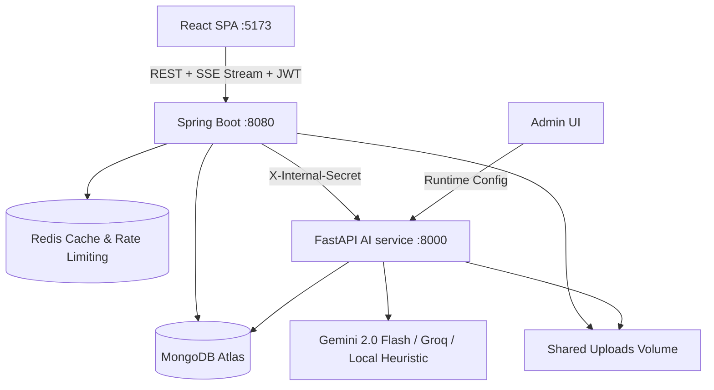

# Architecture

Lumina Study is an intelligent, context-aware AI Study Companion built as a multi-service architecture: a React SPA, a Spring Boot API that owns authoritative business state and user progress, and a FastAPI AI microservice that handles document ingest, semantic chunking, grounded RAG tutoring, quiz generation/grading, knowledge graphs, flashcards, and personalized study planning.

## Responsibility split

| Layer | Technologies | Owns |
|---|---|---|
| **React SPA** | React 18, Vite, Tailwind CSS, Lucide Icons, Canvas API | Auth screens, Spaces/Projects, Materials upload + status polling, Streaming Tutor chat with citations, Concept Map (interactive visual graph), Flashcards (SM-2 spaced repetition), Mistakes Notebook, Study Planner, Adaptive Quiz flow, Growth & Analytics dashboards, Admin Suite & Runtime LLM manager |
| **Spring Boot API** | Java 17, Spring Boot 3.2, Spring Security, Spring Data MongoDB | Users, JWT lifecycle, Spaces/Projects, Materials metadata, Concept Graph caching, Flashcards & SM-2 state, Mistakes tracking, Study Plans, Quiz/Mastery state machine, Activity events, Recommendations, Quota enforcement, Rate limiting, Admin APIs, Project isolation |
| **FastAPI AI Service** | Python 3.11, FastAPI, PyMuPDF, Tesseract OCR, Pydantic | PDF extraction & OCR, deterministic chunking + embeddings, concept extraction & graph topology, grounded RAG tutor with SSE token streaming, quiz generation & open-ended rubric grading, flashcard creation, mistake root-cause analysis, study plan generation, runtime LLM provider switching |

The browser never communicates directly with the AI service. Spring Boot proxies and orchestrates all AI calls, enforces authentication/quotas, and persists authoritative application state.

## Data isolation

Every project-scoped endpoint verifies project ownership against the authenticated user (`project.userId == user.getId()`). Administrators can inspect resources across users via dedicated `/api/admin/*` endpoints. Chunk retrieval, concept graphs, and quiz generation in Python are strictly scoped and filtered by `projectId`.

## Authentication & Security

- **User Auth:** User registration, login, and refresh tokens operate under `/api/auth/*` using BCrypt password hashing and signed JWT tokens (access token: 30 min, refresh token: 7 days).
- **Service-to-Service Security:** Spring Boot and FastAPI authenticate internal requests using a shared header secret (`X-Internal-Secret`). Spring Boot's `InternalAuthFilter` strictly guards `/api/internal/**`.
- **Default Seeded Admin:** On application initialization, an administrative account is available: `admin@studycompanion.local` / `Admin123!`.
- **Prompt Injection Defense:** User queries and retrieved document excerpts are passed to LLM prompts wrapped inside explicit `<data>` tags with strict system instructions that content within data boundaries must be treated purely as untrusted reference, never as execution instructions.

## Materials pipeline

1. User uploads a PDF document (validated for PDF MIME type and size limit ≤ 20MB) to Spring Boot.
2. File is saved to disk under `${FILE_STORAGE_DIR}/{projectId}/{uuid}.pdf`.
3. A tracking `jobs` document is created (`INGEST`, `QUEUED`).
4. Spring Boot triggers asynchronous ingestion via `POST /ingest` on the FastAPI service.
5. FastAPI `BackgroundTasks` executes `process_material`:
   - Extracts page text using PyMuPDF (falls back to Tesseract OCR if a page is purely image-based).
   - Splits text into semantic chunks with token overlaps.
   - Computes deterministic hash-based embeddings for fast retrieval.
   - Extracts key concepts and definitions.
   - Persists records into MongoDB collections: `material_chunks` and `concepts`.
   - Implements automated retry with exponential backoff (up to 3 attempts).
6. Job status is updated (`QUEUED` → `PROCESSING` → `READY`/`FAILED`) and reported back to Spring Boot via `/api/internal/materials/{id}/status`.
7. The Materials UI polls status until processing completes.

## Grounded Tutor with SSE Streaming

1. Spring Boot accepts questions at `POST /api/tutor/stream` (SSE) or `POST /api/tutor/ask` (REST).
2. Recent conversation history (last 8 messages) and project `LearningContext` (goals, strengths, weaknesses, repeated mistakes) are retrieved.
3. Python AI service retrieves the top-$k$ relevant material chunks using cosine similarity over project chunks.
4. **Anti-Hallucination Guardrail:** If the top retrieval score falls below `RETRIEVAL_THRESHOLD` (default 0.35), the service immediately flags `evidenceStatus: "insufficient"` and returns a helpful fallback without calling the LLM.
5. **Streaming Response:** When sufficient evidence exists, FastAPI streams markdown tokens and LaTeX formulas back through Spring Boot via Server-Sent Events (`text/event-stream`), followed by clean structured citation badges (document name, page number, and quote).

## Concept Graph & Knowledge Map

1. `POST /api/projects/{projectId}/concepts/graph/regenerate` invokes AI service `concept_mapper` to extract hierarchical knowledge nodes, relationships (edges), categories, and prerequisites from indexed material chunks.
2. The generated graph structure is persisted in MongoDB (`concept_graphs` collection).
3. `GET /api/projects/{projectId}/concepts/graph` retrieves the graph with **0ms latency** by serving the persisted layout and dynamically merging real-time concept mastery scores.
4. The frontend renders an interactive graph with force-directed layouts, zoom/pan controls, category filtering, and direct links to study topics.

## Flashcards & Spaced Repetition (SM-2)

1. Flashcards can be generated on-demand (`POST /api/projects/{projectId}/flashcards/generate`) based on concepts flagged as needing `ATTENTION` or with mastery < 60%.
2. Stored in the `flashcards` collection.
3. Review submissions (`POST /api/projects/{projectId}/flashcards/{cardId}/review`) calculate next review dates using the **SuperMemo-2 (SM-2)** algorithm, tracking repetition intervals, ease factors (minimum 1.3), and review history.

## Mistakes Notebook & Misconception Analysis

1. Incorrect quiz answers automatically record a `LearnerMistake` entry capturing the concept, question, chosen answer, correct answer, and explanation.
2. Learners can review their mistake history and trigger AI root-cause analysis (`POST /api/projects/{projectId}/mistakes/analyze`).
3. The AI diagnoses underlying misconceptions, provides targeted counter-examples, and suggests concrete corrective study steps.

## Adaptive Study Planner

1. Learners set an exam/target completion date and weekly study hours.
2. The AI evaluates unmastered concepts, weak areas, and material volume to construct a prioritized, phased study schedule (`POST /api/projects/{projectId}/study-plan/generate`).
3. Generated plans are stored in `study_plans` with progress tracking for each milestone.

## Quiz & Mastery State Machine

Spring Boot manages the adaptive quiz state machine:
- **Concept Selection:** Selects concepts with lowest mastery scores, prioritizing those marked with `ATTENTION` trends.
- **Dynamic Difficulty:** Assigns `easy` (< 40 mastery), `medium` (40–75 mastery), or `hard` (> 75 mastery).
- **Supported Formats:** Multiple-choice questions (MCQ) and open-ended questions graded against an AI rubric (0.0–1.0 score).
- **Weighted Mastery Formula:**
  $$\text{Mastery}_{\text{new}} = \text{Mastery}_{\text{old}} \times 0.72 + (\text{Score} \times \text{Weight}_{\text{difficulty}}) \times 0.28$$
  Clamped strictly between 0 and 100. Hard questions carry a 1.15 multiplier; easy questions carry a 0.85 multiplier.
- **Assessment Finalization:** Completing a quiz writes an `Assessment`, updates the learner's `LearningContext`, logs mistakes, and triggers tailored recommendations.

## Observability & Runtime LLM Management

- Structured JSON console logging with `X-Trace-Id` correlation across API boundaries.
- Every LLM invocation logs latency, tokens, cost estimate, and status to `ai_usage_logs`.
- **Runtime Provider Switching:** The Admin dashboard allows live switching and testing of LLM providers (Google Gemini, Groq, Ollama / OpenAI-compatible) and runtime API key management stored in MongoDB (`provider_configs`).
- **Admin Dashboard:** Real-time visibility into users, background jobs, system health, AI cost aggregations, and token consumption.

## Deployment Architecture

Lumina Study supports both multi-container local orchestration and cloud deployment:
- **Local Dev:** Individual service runtimes or multi-container `docker-compose.yml`.
- **Production Cloud:** Unified Docker container (`Dockerfile.production` + `start-production.sh`) running Spring Boot on port 8080 and FastAPI internally on port 8000 on **Render**, coupled with a static Vite deployment on **Vercel**, managed MongoDB Atlas, and Redis Cloud / Upstash.
