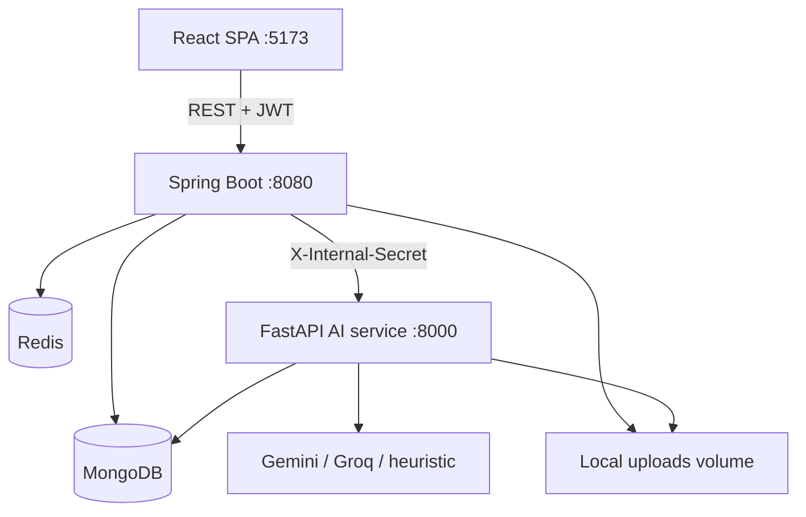

# Architecture

Lumina Study is a three-service prototype: a React SPA, a Spring Boot API that owns product state, and a FastAPI AI service that handles ingest, RAG, quiz generation/grading, and recommendations.

## Responsibility split

| Layer | Owns |
|---|---|
| React | Auth screens, Spaces/Projects, Materials upload + status polling, Tutor chat, Quiz flow, Growth, Analytics, Admin |
| Spring Boot | Users, JWT, Spaces/Projects, material metadata and file save, quiz/mastery state machine, activity events, recommendations storage, admin APIs, project isolation |
| FastAPI | PDF extract/OCR, chunk + embed, concept extract, tutor retrieval + grounded answer, quiz generate/grade, recs, eval harness |

The browser never talks to the AI service. Spring Boot proxies AI calls and persists results.

## Data isolation

Every project-scoped API loads the project and checks `project.userId == authenticated user` (admins may inspect via `/api/admin/*`). Chunk retrieval in Python is always filtered by `projectId`.

## Auth

- Register/login/refresh on `/api/auth/*`.
- Access JWT (default 30 min) + refresh token (7 days) stored in the SPA.
- Internal AI → Spring callbacks use `X-Internal-Secret`. Internal routes are permitAll at Spring Security but rejected by `InternalAuthFilter` unless the secret matches.

Seeded admin (created on first register/login path): `admin@studycompanion.local` / `Admin123!`.

## Materials pipeline

1. User uploads a PDF (type/size checks, max 20MB) to Spring Boot.
2. File is stored under `FILE_STORAGE_DIR/{projectId}/{uuid}.pdf`.
3. A `jobs` document is created (`INGEST`, `QUEUED`).
4. Spring Boot POSTs `/ingest` to FastAPI.
5. FastAPI `BackgroundTasks` runs `process_material`: extract pages (PyMuPDF, Tesseract if a page is nearly empty), chunk, hash-embedding, LLM concept extract, write `material_chunks` + `concepts`, retry up to 3 times with backoff.
6. Status is updated on the material (`QUEUED` → `PROCESSING` → `READY`/`FAILED`) and notified back to Spring via `/api/internal/materials/{id}/status`.
7. The Materials UI polls until Ready/Failed.

Shared Docker volume `uploads` is required so both containers see the same path.

## Tutor (grounded)

1. Spring Boot persists the user message, loads recent messages + learning context, calls `/tutor/answer`.
2. Python embeds the question with the same hash embedding used at ingest, cosine-scores all project chunks, takes top-k.
3. If the best score is below `RETRIEVAL_THRESHOLD` (default 0.35), it returns `evidenceStatus: insufficient` and does **not** call the LLM to invent an answer.
4. Otherwise it builds a prompt with `<data>` wrappers and a system instruction that material is untrusted, validates JSON via Pydantic, and returns citations (material + page + quote).

Tutor is request/response (not SSE) in this prototype.

## Quiz & mastery

Spring Boot owns the state machine: start → generate question → answer → evaluate → mastery write → next (cap 5) → complete.

- Concept pick: lowest mastery, preferring `ATTENTION` trend.
- Difficulty: easy if mastery &lt; 40, hard if &gt; 75, else medium.
- Mastery: `new = old * 0.72 + (eventScore * difficultyWeight) * 0.28`, clamped 0–100. Hard questions weight 1.15, easy 0.85.
- Completing a quiz writes `assessments`, updates `learning_context` (strengths, weaknesses, repeated mistakes ≥2 misses), and generates a recommendation.

## Observability

- JSON console logs on both services.
- `X-Trace-Id` on API responses (`TraceIdFilter`).
- Every LLM call logs `{feature, model, provider, tokens, latencyMs, costEstimate, status}` to `ai_usage_logs` (Spring internal endpoint, Mongo fallback).
- Admin dashboard: users, jobs, activity, AI cost/failures, Mongo health.

## Local vs Docker

| Service | Local | Compose |
|---|---|---|
| Mongo / Redis | `docker compose up mongo redis` or native | included |
| API | `mvn spring-boot:run` :8080 | `backend` |
| AI | `uvicorn app.main:app --port 8000` | `ai-service` |
| Web | `npm run dev` :5173 | nginx on :5173 |

Compose frontend bakes `VITE_API_BASE_URL=http://localhost:8080` at image build time.
